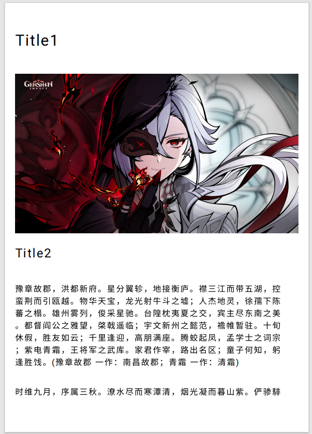
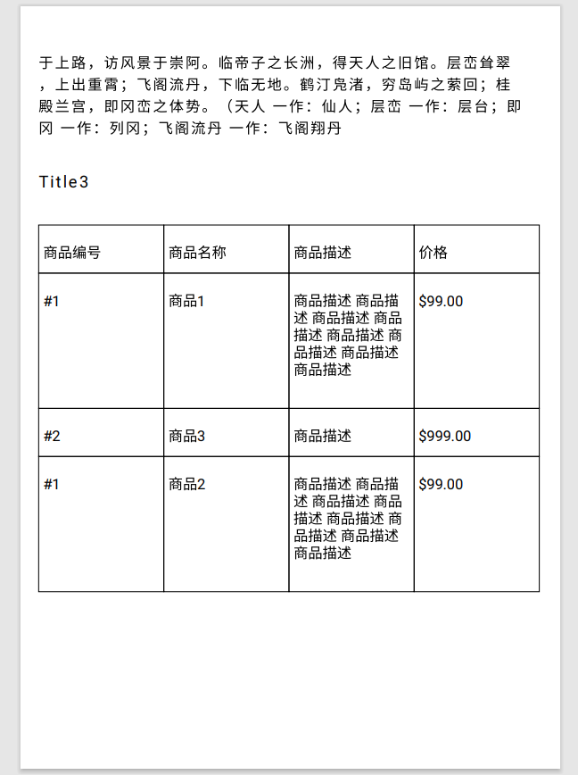
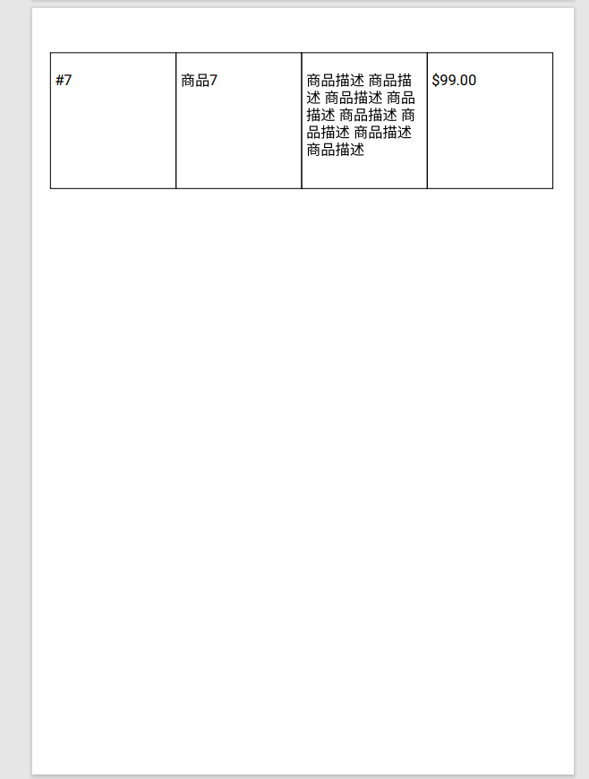

## Android 导出PDF工具类

### 介绍

这是一个使用Android纯原生的方式导出PDF文档的一个工具类。


### 目前支持功能

* 添加一级标题
* 添加二级标题
* 添加三级标题
* 添加图片
* 添加表格

### 下一步开发计划

- [ ] 支持元素Left、Center、Right对齐
- [ ] 支持有序列表
- [ ] 支持无序列表
- [ ] 重构代码-将统一的Configuration改为单独Configuration

### 使用方式

| 方法                         | 描述               | 备注 |
| ---------------------------- | ------------------ | ---- |
| addH1                        | 添加H1标题         |      |
| addH2                        | 添加H2标题         |      |
| addH3                        | 添加H3标题         |      |
| addParagraph                 | 添加段落           |      |
| addImage                     | 添加图片           |      |
| addTable                     | 添加表格           |      |
| export(stream: OutputStream) | 导出文件到指定位置 |      |

#### Configuration

所有的设置均通过Configuration实现，默认大小为A4纸大小，如果更改任何选项可以提供一个新的Configuration。

#### 案例代码

```kotlin
this.findViewById<Button>(R.id.btnExport).setOnClickListener {
    val bitmap = BitmapFactory.decodeResource(this.resources, R.drawable.pdf_img)
    val outputStream = File(filesDir, "export.pdf").outputStream()
    PDFDocumentExporter(this)
        .addH1("Title1")
        .addImage(bitmap)
        .addH2("Title2")
        .addH3("Title3")
        .addParagraph("豫章故郡,洪都新府")
        .addTable(Table().apply {
            addColumn("商品编号", "商品名称", "商品描述", "价格")
            addRow(
                "#1",
                "商品1",
                "商品描述 商品描述 商品描述 商品描述 商品描述 商品描述 商品描述 商品描述",
                "$99.00"
            )
        })
        .export(outputStream)
}
```


### 导出PDF效果图






